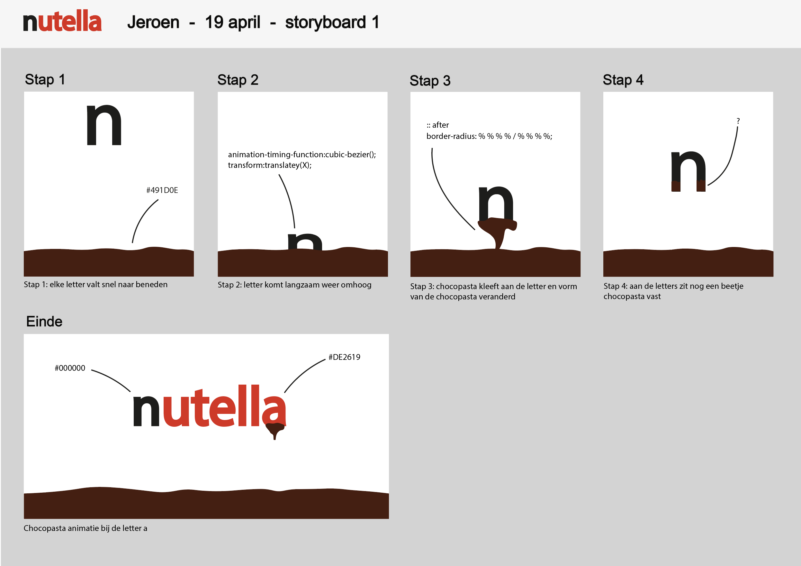
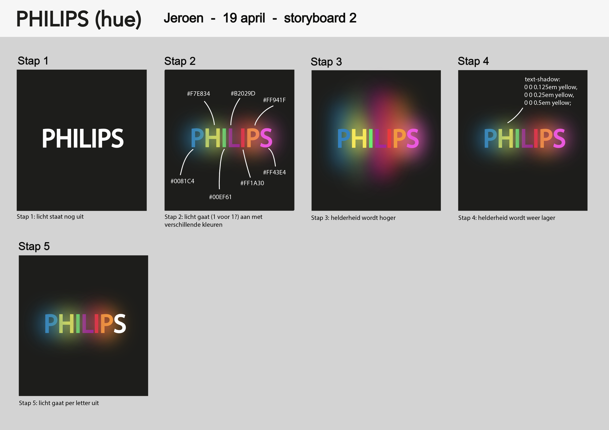
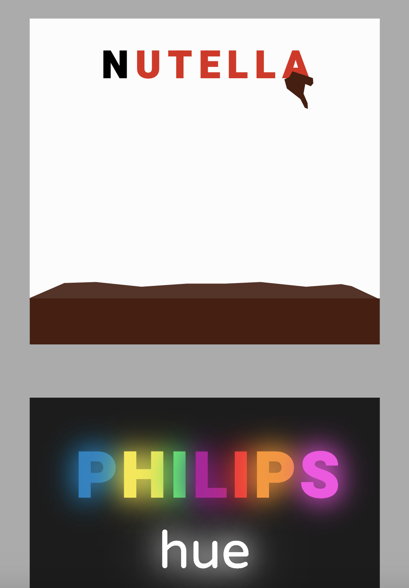
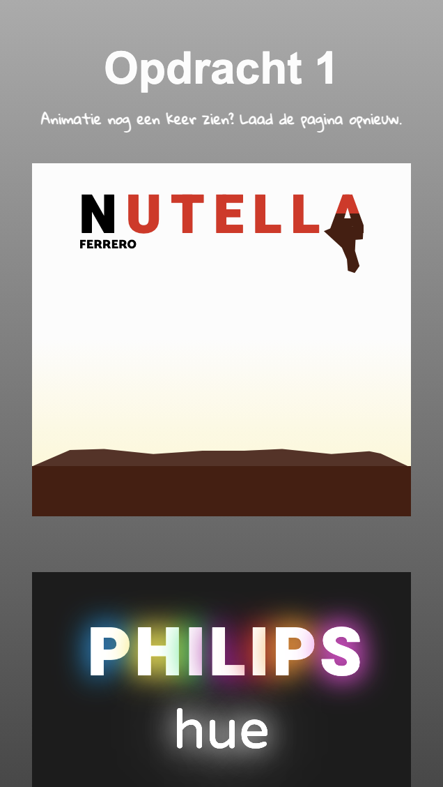
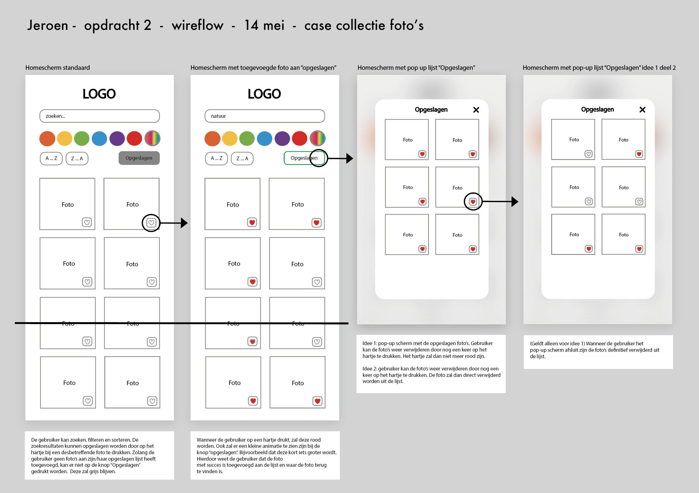
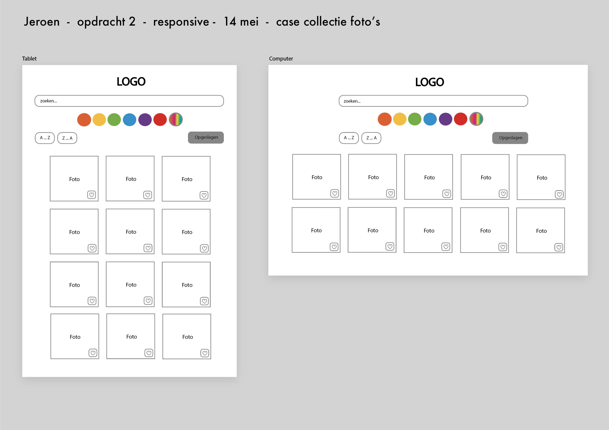
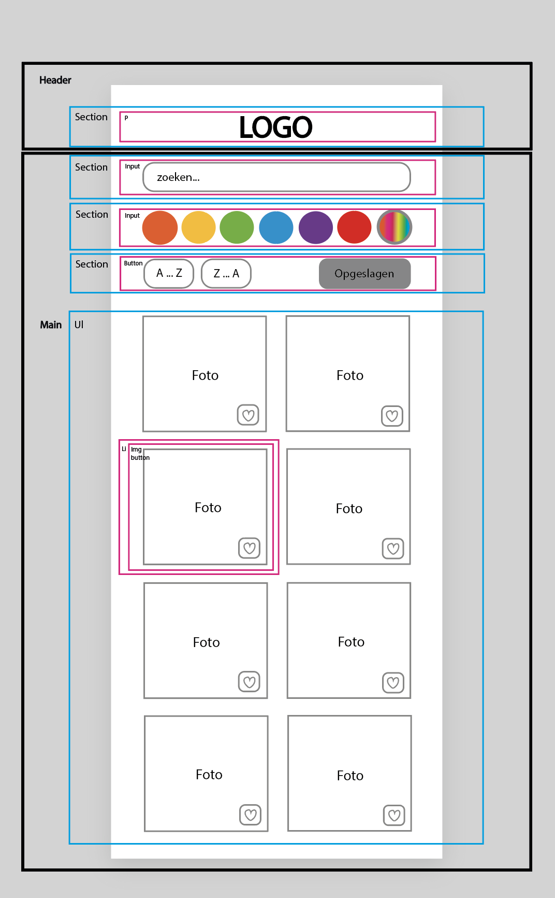
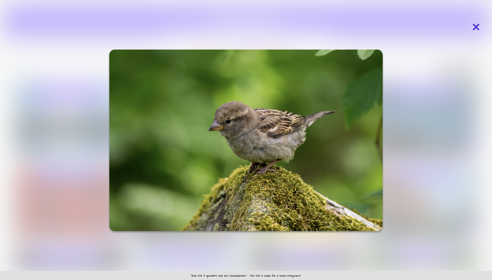
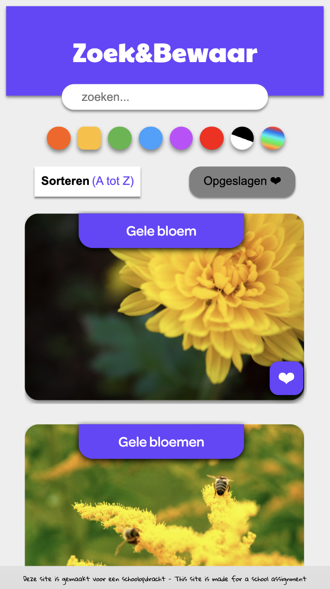
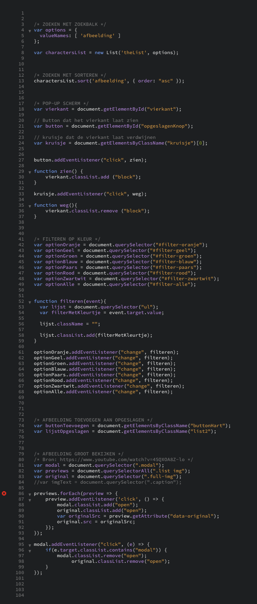

# Procesverslag
**Auteur:** Jeroen

**Het werk:** [opdracht 1](opdracht1/index.html) en [opdracht 2](opdracht2/index.html)

Markdown cheat cheet: [Hulp bij het schrijven van Markdown](https://github.com/adam-p/markdown-here/wiki/Markdown-Cheatsheet). Nb. de standaardstructuur en de spartaanse opmaak zijn helemaal prima. Het gaat om de inhoud van je procesverslag. Besteedt de tijd voor pracht en praal aan je website.

## Bronnenlijst
1. Slider HTML en CSS: https://www.w3schools.com/howto/howto_js_rangeslider.asp
2. Lettertype: https://fonts.google.com
3. Annimatie niet laten herhalen: https://stackoverflow.com/questions/17296919/how-to-prevent-css3-animation-reset-when-finished
3. Animation timing function: https://matthewlein.com/tools/ceaser
4. Before and after: https://www.youtube.com/watch?v=zGiirUiWslI en https://css-tricks.com/almanac/selectors/a/after-and-before/
5. Welke lengte gebruiken: https://www.w3schools.com/cssref/css_units.asp
6. CSS custom properties: https://www.youtube.com/watch?v=PHO6TBq_auI
7. Pop-up afbeelding groot: https://www.youtube.com/watch?v=4SQXOA8Z-lo
8. Zoekbalk placeholder aanpassen: https://www.w3schools.com/howto/howto_css_placeholder.asp
9. Radio button aanpassen: https://stackoverflow.com/questions/4253920/how-do-i-change-the-color-of-radio-buttons/38468320
10. Responsive website: https://www.youtube.com/watch?v=bam83Xv4VMA
11. CSS flex-flow: https://stackoverflow.com/questions/37226787/align-content-not-working-on-flex-items/52621741
12. Wat (e) doet in JavaScript: https://stackoverflow.com/questions/10323392/in-javascript-jquery-what-does-e-mean

## Je 'posts' (je code-dagboek)

Je procesverslag is een soort dagboek.
Bij elk voortgangsgesprek en het eindgesprek voeg je een ‘post’ aan je dagboek toe.

In zo’n ‘post’ neem je op:
- Wat je van plan was
- Je werk zo ver
- Wat er goed ging
- Wat er lastig is
- Wat je plannen zijn

## Voortgang 1 (week 2)

### Stand van zaken

Ik ga vandaag beginnen aan opdracht 1, dus voor dit gesprek heb ik nog geen code dat ik kan laten zien. Ik heb wel een storyboard gemaakt, zodat duidelijk wordt wat ik wil gaan maken. 

## Voortgang 2 (week 3)

### Stand van zaken

Deze week begonnen met het schrijven van HTML en CSS. Plan was om deze week zo ver mogelijk te komen met opdracht 1, zodat ik weet waar ik vandaag vragen over moet stellen. Ik vind het lastig de letters en animaties responsive te maken. Op dit moment zijn de animaties alleen juist op één formaat. Verder is het mij nog niet gelukt om een werkende slider te maken. Ook weet ik nog niet zo goed hoe ik "blend-mode" moet gebruiken bij de gekleurde letters. Ik ben al best tevreden met de vormgeving en animaties tot nu toe. Ik hoop dat ik na het gesprek 'de problemen' kan oplossen waar ik nu tegen aan loop. Wanneer ik nog tijd over heb, wil ik proberen extra effecten toe te voegen. 

## Voortgang 3 (einde van opdracht 1)

### Stand van zaken

Plan was om nieuwe animaties te maken, 'oude' animaties te verbeteren/uit te breiden en responsive te maken. Verder wilde ik de code 'opruimen' en 'de puntjes op de i' zetten. Als ik nog tijd over zou hebben, was het de bedoeling om de slider met JavaScript te maken.
Het maken van de animaties ging goed, het was vooral erg veel proberen, testen en verbeteren. Uiteindelijk is het gelukt om de animaties responsive te maken met hulp van de docent. Ik had vooral moeite om ervoor te zorgen dat de letters van Nutella altijd 50% in de chocopasta terecht zouden komen. Het gebruik maken van before and after en de custom properties ging goed. Helaas nog niet gelukt om een werkende slider te maken met JavaScript. Verder geleerd om vormpjes te maken met clip-path en deze ook te animeren. De animaties werken soepel in Google Chrome, maar nog niet in Safari.  Ook is het gelukt om geen class en id te gebruiken, dit was met het vak Front-end Development nog best een uitdaging... 
Het gebruik maken van Google Fonts was nieuw voor mij: erg handig en gemakkelijk.

## Voortgang 3.5 (begin opdracht 2)

### Stand van zaken

Opdracht 2: "In een diverse collectie foto's wil ik kunnen zoeken/sorteren/filteren op kleur en andere aspecten om verassende zoekresultaten te krijgen die ik kan gebruiken voor mijn visual research."

Idee voor opdracht 2:

## Voortgang 4 (week 7)

### Stand van zaken

Het plan was om aan de slag te gaan met opdracht 2. Ik ben eerst begonnen met de HTML en CSS. Ik had nog niet eerder een responsive website gemaakt, dus ik moest eerst even het een en ander opzoeken hoe dit moest. Ik heb voor de eerste keer gebruik gemaakt van "grid-template-columns" - erg handig. Verder heb ik opgezocht hoe ik de zoekbalk en de radio buttons kan aanpassen. Dit is uiteindelijk gelukt en ik ben tevreden met het resultaat. Precies hoe ik het in gedachte had. Ik heb de kennis van de les en oefeningen toegepast om de zoekbalk en de sorteer-knop werkend te krijgen. 
Waar ik meer moeite mee had was het werkend krijgen van de filter-knoppen. Dit was wel even lastig, maar met hulp van de uitwerkingen van een van de oefeningen is het uiteindelijk gelukt. 
Hierna ben ik aan de slag gegaan met het pop-up scherm voor het vergroten van een afbeelding. Ik heb dit eerst zelf geprobeerd, maar zonder succes. Na veel YouTube video's bekeken te hebben kwam ik bij een video terecht met een uitleg waar ik precies naar opzoek was: pop-up scherm met nette JavaScript en waar gelijk uitgelegd werd hoe je gebruik kan maken van twee verschillende afbeeldingen. Één met meer MB dan de andere. Hierdoor laden de afbeeldingen sneller en wordt pas de afbeelding met veel MB geladen wanneer de gebruiker de afbeelding vergroot wil bekijken. Ik heb de JavaScript van de video overgenomen om te kijken hoe en of het goed werkt. Helaas werkte de pop-up bij mij nog niet. Ik heb uren gezocht waar de fout zat, maar kon het niet vinden. Ik had wel een vermoeden waar de fout zat... Uiteindelijk maar om hulp gevraagd - de docent heeft de fout gevonden: een spelfoutje. 
Het is nu de bedoeling om aan de slag te gaan met het kunnen toevoegen van afbeeldingen aan de favorieten lijst. Ik denk dat dit erg lastig gaat worden en ga vandaag tijdens het gesprek vragen hoe ik precies moet beginnen en waar ik eventueel een goed voorbeeld kan vinden. Het is namelijk ook de bedoeling dat de "opgeslagen" knop eerst grijs is. Pas wanneer de gebruiker een afbeelding toevoegd aan de lijst, moet deze knop wit worden. De knop met het hartje bij de desbetreffende afbeelding moet dan ook rood zijn geworden. Wanneer dit is gelukt kan ik nog extra animaties toevoegen zoals een effect wanneer de afbeelding met succes is toegevoegd. Maar ik ga ervan uit dat ik voorlopig nog wel zoet ben met het 'gewoon' basic toevoegen van een afbeelding aan de lijst - en deze ook weer uit de lijst kunnen verwijderen. 
Ik heb tot nu toe al veel geleerd van opdracht 2, want ik had hiervoor amper kennis van JavaScript en het responsive maken van een website.  

